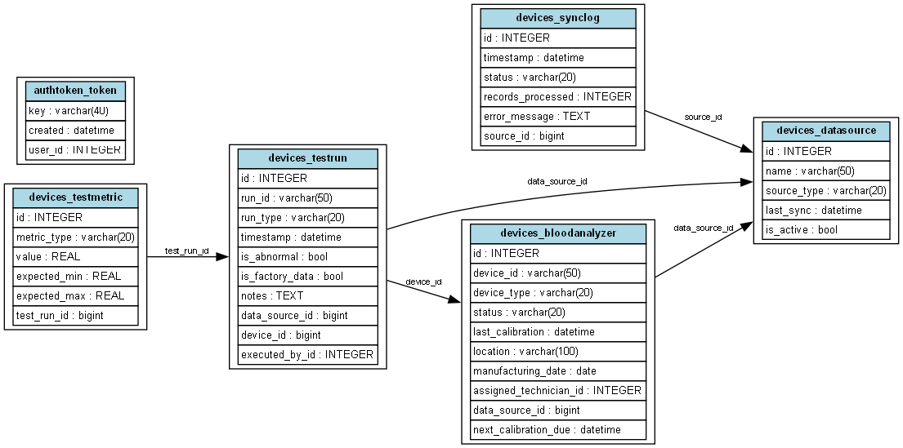
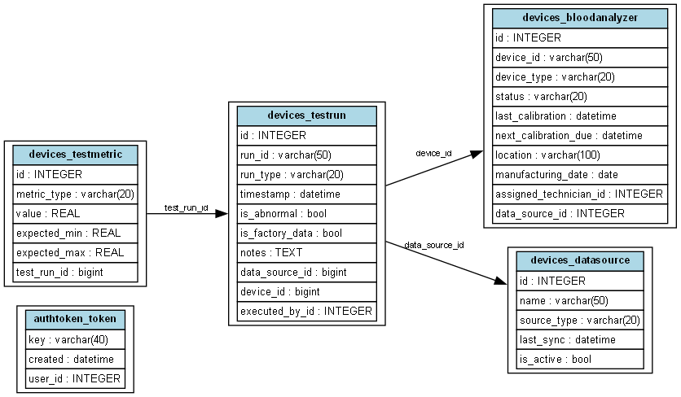

# VitalApp - Blood Analyzer Data Management System

A Django-based system for managing blood analyzer data across multiple factory databases with synchronization capabilities.

## System Architecture

The system consists of:
1. A central default database
2. Multiple factory databases (factory_a, factory_c)
3. A synchronization service that moves data from factory databases to the central database
4. A test data generation service that simulates factory data

### Database Structure

- **Default Database**: Central database that stores synchronized data from all factories
- **Factory Databases**: Individual databases for each factory (factory_a, factory_c)
- **Data Flow**: Factory data → Sync Service → Default Database

## Directory Structure

```
VitalApp/
├── devices/                      # Main application directory
│   ├── management/              # Management commands
│   │   └── commands/           # Custom Django commands
│   │       ├── clear_test_data.py      # Clears all test data from databases
│   │       ├── generate_test_data.py   # Generates test data for factories
│   │       ├── init_factory_dbs.py     # Initializes factory databases
│   │       └── ... (other commands)
│   ├── migrations/              # Database migrations
│   ├── services/               # Business logic services
│   │   ├── analyzer.py        # Analyzer-related operations
│   │   ├── sync.py            # Synchronization service
│   │   ├── sync_log.py        # Sync log management
│   │   ├── test_metric.py     # Test metric operations
│   │   └── test_run.py        # Test run operations
│   ├── models.py              # Database models
│   ├── views.py               # API views
│   ├── serializers.py         # API serializers
│   ├── urls.py               # URL routing
│   └── admin.py              # Django admin configuration
├── db.sqlite3                # Default database
├── factory_a.sqlite3         # Factory A database
├── factory_c.sqlite3         # Factory C database
└── requirements.txt          # Python dependencies
```

## Key Components

### Models

1. **BloodAnalyzer**
   - Represents a blood analyzer device
   - Fields: device_id, device_type, status, location, etc.

2. **TestRun**
   - Represents a test run performed by an analyzer
   - Fields: run_id, device, executed_by, timestamp, etc.

3. **TestMetric**
   - Represents individual metrics from a test run
   - Fields: test_run, metric_type, value, expected_min, expected_max

4. **DataSource**
   - Represents a data source (factory or central)
   - Fields: name, source_type, last_sync, is_active

5. **SyncLog**
   - Tracks synchronization operations
   - Fields: source, timestamp, status, records_processed, error_message

### Services

1. **Sync Service** (`sync.py`)
   - Handles data synchronization from factories to central database
   - Features:
     - Incremental sync (only new/updated records)
     - Error handling and logging
     - Transaction management

2. **Test Data Generation** (`generate_test_data.py`)
   - Simulates factory data generation
   - Features:
     - Configurable generation interval
     - Realistic test data
     - Multiple metric types

3. **Test Run Service** (`test_run.py`)
   - Manages test run operations
   - Features:
     - Run creation and validation
     - Metric management
     - Data integrity checks

## Setup and Installation

1. **Prerequisites**
   ```bash
   python -m venv .venv
   source .venv/bin/activate  # On Windows: .venv\Scripts\activate
   pip install -r requirements.txt
   ```

2. **Initialize Databases**
   ```bash
   python manage.py migrate
   python manage.py init_factory_dbs
   ```

3. **Generate Test Data**
   ```bash
   python manage.py generate_test_data
   ```

4. **Start Development Server**
   ```bash
   python manage.py runserver
   ```

## Running the System

1. **Start Test Data Generation**
   ```bash
   python manage.py generate_test_data --interval 180  # Generate data every 3 minutes
   ```

2. **Start Synchronization**
   ```bash
   python manage.py sync_all_sources  # Run sync manually
   # Or use the API endpoint: POST /api/sync/
   ```

3. **Clear Test Data**
   ```bash
   python manage.py clear_test_data
   ```

## API Endpoints

- `GET /api/analyzers/` - List all analyzers
- `GET /api/test-runs/` - List all test runs
- `GET /api/sync-logs/` - View sync history
- `POST /api/sync/` - Trigger manual sync

## Monitoring and Maintenance

1. **Check Sync Status**
   ```bash
   python manage.py check_sync_status
   ```

2. **View Sync Logs**
   - Access `/admin/devices/synclog/` in Django admin
   - Or use API endpoint: `GET /api/sync-logs/`

3. **Database Maintenance**
   - Regular backups of all databases
   - Monitor sync log for errors
   - Check data consistency across databases

## Troubleshooting

1. **Sync Issues**
   - Check sync logs for error messages
   - Verify database connections
   - Ensure proper permissions

2. **Data Generation Issues**
   - Verify factory database structure
   - Check for sufficient disk space
   - Monitor system resources

3. **API Issues**
   - Check server logs
   - Verify API endpoints
   - Test database connectivity

## Best Practices

1. **Data Management**
   - Regular backups
   - Monitor sync performance
   - Validate data integrity

2. **System Maintenance**
   - Regular updates
   - Monitor system resources
   - Check for errors in logs

3. **Development**
   - Follow Django best practices
   - Write unit tests
   - Document changes

## Database Schema

The system uses multiple databases to manage different aspects of the application:

1. **Default Database**: Central database for managing data sources and sync logs
2. **Factory A Database**: Contains test runs and metrics for Factory A
3. **Factory C Database**: Contains test runs and metrics for Factory C

### Schema Diagrams

Below are the schema diagrams for each database, showing the main application tables and their relationships:

#### Default Database Schema


#### Factory A Database Schema


#### Factory C Database Schema


### Key Tables

- **BloodAnalyzer**: Stores information about blood analyzers
- **TestRun**: Records test runs performed by analyzers
- **TestMetric**: Contains metrics and measurements from test runs
- **DataSource**: Manages data sources for different factories
- **SyncLog**: Tracks synchronization operations between databases

